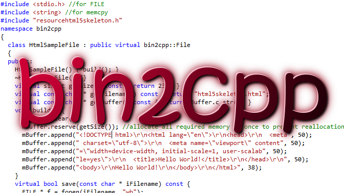
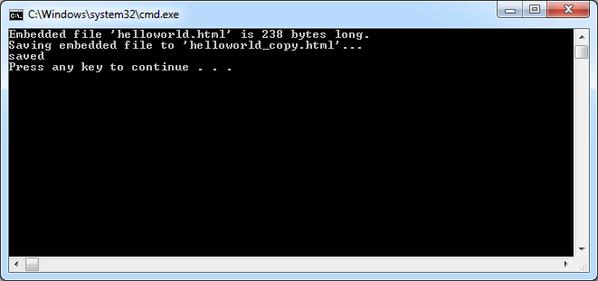

# bin2cpp

[](https://opensource.org/licenses/MIT)
[](https://github.com/end2endzone/bin2cpp/releases)

bin2cpp is a command line tool for embedding small files (like images, icons or raw data files) into a C++ executable.

When executed, bin2cpp takes binary file as input and outputs c++ code (a function) that when called allows a c++ program to retrieve the content of the input binary file.

## Status

Build:

| Service/Platform    | Build                                                                                                                                                                                   | Tests                                                                                                                                                                                                                                                  |
| ------------------- | --------------------------------------------------------------------------------------------------------------------------------------------------------------------------------------- | ------------------------------------------------------------------------------------------------------------------------------------------------------------------------------------------------------------------------------------------------------ |
| AppVeyor            | [](https://ci.appveyor.com/project/end2endzone/bin2cpp)                 | [](https://ci.appveyor.com/project/end2endzone/bin2cpp/branch/master/tests)                                                         |
| Travis CI           | [](https://travis-ci.org/end2endzone/bin2cpp)                    |                                                                                                                                                                                                                                                        |
| Windows Server 2019 | [](https://github.com/end2endzone/bin2cpp/actions/workflows/build_windows.yml) | [](https://github.com/end2endzone/bin2cpp/actions/workflows/build_windows.yml) |
| Ubuntu 20.04        | [](https://github.com/end2endzone/bin2cpp/actions/workflows/build_linux.yml)       | [](https://github.com/end2endzone/bin2cpp/actions/workflows/build_linux.yml)       |
| macOS 10.15         | [](https://github.com/end2endzone/bin2cpp/actions/workflows/build_macos.yml)       | [](https://github.com/end2endzone/bin2cpp/actions/workflows/build_macos.yml)       |

Statistics:

| AppVeyor                                                                                                                                       | Travic CI                                                                                                              | GitHub                                                                                                                     |
| ---------------------------------------------------------------------------------------------------------------------------------------------- | ---------------------------------------------------------------------------------------------------------------------- | -------------------------------------------------------------------------------------------------------------------------- |
| [](https://ci.appveyor.com/project/end2endzone/bin2cpp/branch/master) | [](https://travis-ci.org/end2endzone/bin2cpp) | [](https://github.com/end2endzone/bin2cpp/actions/) |

# Purpose

bin2cpp is not implemented using [executable resources](http://en.wikipedia.org/wiki/Resource_(Windows)). Instead, bin2cpp creates a single function call for retrieving the content and the properties of a file which makes it harder to steal the executable's content. It also makes it even harder to replace an existing resource of the executable.

It is designed to be easy to use by developers and to provide easy call functions to get access to the data of the embedded files.

The generated functions that reads and extracts the embedded content does not rely on external libraries so you don't need to setup your projects to use any third party library to start using bin2cpp. All your embedded data can be accessed right away.

# Features

The main features of the project are:

* Easily converts small files as C++ source code for embedding into a C++ executable.
* Access content with a unique function call for each embedded file.
* Supports multiple embedded files at once.
* Makes it harder for resource hacker to modify or steal the embedded files.
* No third party libraries required for retrieving the data of the embedded files.
* Supports different types of code generator: string, segment, array.
* File's originals `size` and `filename` properties available from generated source code.
* Source code control: select a custom file interface and namespace.

## Use cases

The following list show situations where bin2cpp is useful:

* Embedding default configuration files if none are provided.
* Embedding GLSL shaders into the executable.
* Embedding text or XML databases (gui layout, names, dictionaries or localization strings)
* A portable alternative to C++11 raw string literals.
* Prevent stealing copyrighted resources.
* Embedding images/icons/sounds for a GUI application. The application executable can be shipped/copied as a single file. 
* Embedding a long PL/SQL code string.
* Allowing an executable to be downloaded from an intranet server as a single file.
* Distributing an application without an installer package. All configurations files and resources can be embedded and extracted at first launch of the application.

# Usage

The following section shows how to use bin2cpp with code examples:

## Command Line Usage

```
bin2cpp --file=<path> --output=<path> --headerfile=<name> --identifier=<name>
        [--generator=<name>] [--encoding=<name>] [--chunksize=<value>] [--namespace=<value>]
        [--baseclass=<name>] [--managerfile=<name>] [--namespace=<name>] [--registerfile] 
        [--override] [--noheader] [--quiet]
bin2cpp --help
bin2cpp --version
```

| Argument             | Description                                                                                                                                                                                                               |
| -------------------- | ------------------------------------------------------------------------------------------------------------------------------------------------------------------------------------------------------------------------- |
| --help               | Display this help message.                                                                                                                                                                                                |
| --version            | Display this application version.                                                                                                                                                                                         |
| --file=<path>        | Path of the input file used for embedding as C++ source code.                                                                                                                                                             |
| --dir=<path>         | Path of the input directory used for embedding all files of the directory as C++ source code. When specified, the parameters 'headerfile' and 'identifier' are automatically calculated and cannot be manually specified. |
| --output=<path>      | Output folder where to create generated code. ie: .\generated_files                                                                                                                                                       |
| --headerfile=<name>  | File name of the generated C++ header file. ie: SplashScreen.h                                                                                                                                                            |
| --generator=<name>   | Name of the generator to use. Possible values are 'segment', 'string', 'array' and 'win32'. [default: segment].                                                                                                           |
| --encoding=<name>    | Name of the binary to string literal encoding to use. Possible values are 'oct' and 'hex'. [default: oct].                                                                                                                |
| --identifier=<name>  | Identifier of the function name that is used to get an instance of the file. ie: SplashScreen                                                                                                                             |
| --chunksize=<value>  | Size in bytes of each string segments (bytes per row). [default: 200].                                                                                                                                                    |
| --baseclass=<name>   | The name of the interface for embedded files. [default: File].                                                                                                                                                            |
| --namespace=<name>   | The namespace of the generated source code [default: bin2cpp].                                                                                                                                                            |
| --managerfile=<name> | File name of the generated C++ header file for the FileManager class. ie: FileManager.h.                                                                                                                                  |
| --registerfile       | Register the generated file to the FileManager class. This flags is automatically set when parameter 'managerfile' is specified. [default: false].                                                                        |
| --override           | Tells bin2cpp to overwrite the destination files.                                                                                                                                                                         |
| --noheader           | Do not print program header to standard output.                                                                                                                                                                           |
| --quiet              | Do not log any message to standard output.                                                                                                                                                                                |

## Example 1 - single file

This examples shows how to use bin2cpp to convert a single html file to c++ source code.

### Input file: helloworld.html

```html
<!DOCTYPE html>
<html lang="en">
<head>
  <meta charset="utf-8">
  <meta name="viewport" content="width=device-width, initial-scale=1, user-scalable=yes">
  <title>Hello World!</title>
</head>
<body>
Hello World!
</body>
</html>
```

### Command:

```
bin2cpp.exe --file=helloworld.html --output=.\outdir --headerfile=generated_helloworld.h
            --identifier=HelloWorldHtml --chunksize=50
```

### Console output

```
bin2cpp v2.4.0 - Convert binary files into C++ source code.
Copyright (C) 2013-2021 end2endzone.com. All rights reserved.
bin2cpp is open source software, see http://github.com/end2endzone/bin2cpp
Embedding "helloworld.html" using chunks of 50 bytes...
Writing file ".\outdir\generated_helloworld.h"...
Writing file ".\outdir\generated_helloworld.cpp"...
```

### Output file: generated_helloworld.h

```cpp
/**
 * This file was generated by bin2cpp v2.4.0
 * Copyright (C) 2013-2021 end2endzone.com. All rights reserved.
 * bin2cpp is open source software, see http://github.com/end2endzone/bin2cpp
 * Source code for file 'helloworld.html', last modified 1548537787.
 * Do not modify this file.
 */
#ifndef GENERATED_HELLOWORLD_H
#define GENERATED_HELLOWORLD_H

#include <stddef.h>

namespace bin2cpp
{
  #ifndef BIN2CPP_EMBEDDEDFILE_CLASS
  #define BIN2CPP_EMBEDDEDFILE_CLASS
  class File
  {
  public:
    virtual size_t getSize() const = 0;
    virtual const char * getFilename() const = 0;
    virtual const char * getBuffer() const = 0;
    virtual bool save(const char * iFilename) const = 0;
  };
  #endif //BIN2CPP_EMBEDDEDFILE_CLASS
  const File & getHelloWorldHtmlFile();
}; //bin2cpp

#endif //GENERATED_HELLOWORLD_H
```

### Output file: generated_helloworld.cpp

```cpp
/**
 * This file was generated by bin2cpp v2.4.0
 * Copyright (C) 2013-2021 end2endzone.com. All rights reserved.
 * bin2cpp is open source software, see http://github.com/end2endzone/bin2cpp
 * Source code for file 'helloworld.html', last modified 1548537787.
 * Do not modify this file.
 */
#if defined(_WIN32) && !defined(_CRT_SECURE_NO_WARNINGS)
#define _CRT_SECURE_NO_WARNINGS
#endif
#include "generated_helloworld.h"
#include <stdio.h> //for FILE
#include <string> //for memcpy
namespace bin2cpp
{
  class HelloWorldHtmlFile : public virtual bin2cpp::File
  {
  public:
    HelloWorldHtmlFile() { build(); }
    virtual ~HelloWorldHtmlFile() {}
    virtual size_t getSize() const { return 238; }
    virtual const char * getFilename() const { return "helloworld.html"; }
    virtual const char * getBuffer() const { return mBuffer.c_str(); }
    void build()
    {
      mBuffer.clear();
      mBuffer.reserve(getSize()); //allocate all required memory at once to prevent reallocations
      mBuffer.append("<!DOCTYPE html>\r\n<html lang=\"en\">\r\n<head>\r\n  <meta", 50);
      mBuffer.append(" charset=\"utf-8\">\r\n  <meta name=\"viewport\" content", 50);
      mBuffer.append("=\"width=device-width, initial-scale=1, user-scalab", 50);
      mBuffer.append("le=yes\">\r\n  <title>Hello World!</title>\r\n</head>\r\n", 50);
      mBuffer.append("<body>\r\nHello World!\r\n</body>\r\n</html>", 38);
    }
    virtual bool save(const char * iFilename) const
    {
      FILE * f = fopen(iFilename, "wb");
      if (!f) return false;
      size_t fileSize = getSize();
      const char * buffer = getBuffer();
      fwrite(buffer, 1, fileSize, f);
      fclose(f);
      return true;
    }
  private:
    std::string mBuffer;
  };
  const File & getHelloWorldHtmlFile() { static HelloWorldHtmlFile _instance; return _instance; }
}; //bin2cpp
```

### Code sample (querying the generated code)

At runtime, show file properties and save/export data back to a file.

```cpp
#include <stdio.h>
#include <string>
#include "generated_helloworld.h" //a single include file is all you need

int main(int argc, char* argv[])
{
  //get a reference to the embedded file
  const bin2cpp::File & resource = bin2cpp::getHelloWorldHtmlFile();

  //print information about the file.
  printf("Embedded file '%s' is %lu bytes long.\n", resource.getFilename(), resource.getSize());

  //Saving content back to a file.
  printf("Saving embedded file to 'helloworld_copy.html'...\n");
  bool saved = resource.save("helloworld_copy.html");
  if (saved)
    printf("saved\n");
  else
    printf("failed\n");

  //Get the internal buffer and do something with the binary data
  const char * buffer = resource.getBuffer();
  size_t bufferSize = resource.getSize();
  //...

  return 0;
}
```

## Examples 2 - directory

This examples shows how to use bin2cpp to convert multiple files of the same directory to c++ source code.

### Input directory: [samples/demo_icons/flat-color-icons](samples/demo_icons/flat-color-icons).

The [samples/demo_icons/flat-color-icons](samples/demo_icons/flat-color-icons) directory contains the following 56 icons :


These icons are from the *Very Basic* set of [Icons8 Flat Color Icons](https://github.com/icons8/flat-color-icons) and are licensed under the [Good Boy License](https://icons8.com/good-boy-license).

### Command:

```
bin2cpp.exe --dir=flat-color-icons --managerfile=IconsFileManager.h --output=.\outdir --chunksize=50
```

### Console output

```
bin2cpp v2.4.0 - Convert binary files into C++ source code.
Copyright (C) 2013-2021 end2endzone.com. All rights reserved.
bin2cpp is open source software, see http://github.com/end2endzone/bin2cpp
Embedding "flat-color-icons\about.png" using chunks of 50 bytes...
Writing file ".\outdir\about.h"...
Writing file ".\outdir\about.cpp"...
Embedding "flat-color-icons\address_book.png" using chunks of 50 bytes...
Writing file ".\outdir\address_book.h"...
Writing file ".\outdir\address_book.cpp"...
...
Embedding "flat-color-icons\video_file.png" using chunks of 50 bytes...
Writing file ".\outdir\video_file.h"...
Writing file ".\outdir\video_file.cpp"...
Generating "IconsFileManager.h"...
Writing file ".\outdir\IconsFileManager.h"...
Writing file ".\outdir\IconsFileManager.cpp"...
```

Notice that additional files `IconsFileManager.h` and `IconsFileManager.cpp` were also generated and will allow retreiving all files at once.

### Code sample (querying the generated code)

At runtime, show a file listing and save/export the icons files in users temporary directory.

```cpp
#include <stdio.h>  // printf
#include <stdlib.h> // getenv

#include "IconsFileManager.h"

int main(int argc, char* argv[])
{
  bin2cpp::FileManager & mgr = bin2cpp::FileManager::getInstance();

  //Print information about all files generated with "--managerfile" or --registerfile flags.
  size_t num_files = mgr.getFileCount();
  printf("Found %lu embedded icon files...\n", num_files);

  //Listing files.
  for(size_t i=0; i<num_files; i++)
  {
    const bin2cpp::File * file = mgr.getFile(i);
    printf("  File '%s', %lu bytes\n", file->getFilename(), file->getSize());
  }

  //Saving content back to files.
  const char * temp_dir = getenv("TEMP");
  printf("Saving embedded icons to directory '%s'...\n", temp_dir);
  bool saved = mgr.saveFiles(temp_dir);
  if (saved)
    printf("saved\n");
  else
    printf("failed\n");

  return 0;
}
```

### Console output

```
Found 56 embedded icons...
  File 'about.png', 520 bytes
  File 'address_book.png', 1412 bytes
  File 'alarm_clock.png', 2334 bytes
  File 'audio_file.png', 523 bytes
  File 'binoculars.png', 1347 bytes
  File 'bookmark.png', 478 bytes
  File 'broken_link.png', 1522 bytes
  File 'calculator.png', 574 bytes
  File 'calendar.png', 574 bytes
  File 'cancel.png', 1159 bytes
  File 'checkmark.png', 666 bytes
  File 'clock.png', 1534 bytes
  File 'contacts.png', 626 bytes
  ...
  File 'support.png', 1292 bytes
  File 'synchronize.png', 1269 bytes
  File 'unlock.png', 718 bytes
  File 'upload.png', 467 bytes
  File 'video_file.png', 472 bytes
Saving embedded icons to directory 'C:\Users\foobar\AppData\Local\Temp'...
saved
```

## Screenshots

[](docs/bin2cpp-v2.4.0-sample.png)

bin2cpp v2.4.0 Sample

[](docs/demo-extraction-sample.png)

Demo extraction sample

# Build

Please refer to file [INSTALL.md](INSTALL.md) for details on how installing/building the application.

# Platform

bin2cpp has been tested with the following platform:

* Linux, 32 and 64 bit
* Windows, 32 and 64 bit
* macOS, 32 and 64 bit

# Versioning

We use [Semantic Versioning 2.0.0](http://semver.org/) for versioning. For the versions available, see the [tags on this repository](https://github.com/end2endzone/bin2cpp/tags).

# Authors

* **Antoine Beauchamp** - *Initial work* - [end2endzone](https://github.com/end2endzone)

See also the list of [contributors](https://github.com/end2endzone/bin2cpp/blob/master/AUTHORS) who participated in this project.

# License

This project is licensed under the MIT License - see the [LICENSE](LICENSE) file for details
